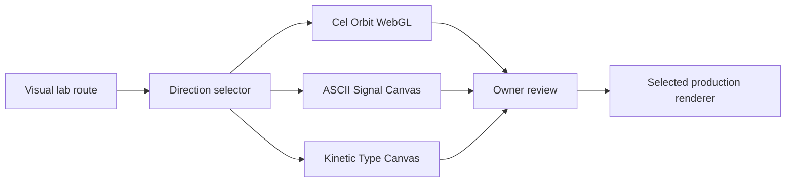

# Design

## Direction contract

**THESIS:** Source speech should feel visually authored without pretending that
generated imagery is documentary footage. Refuse unrelated B-roll montage.

**OWN-WORLD:** Three distinct probes share only persistent provenance and the
ZEROPOD identity: warm outlined cel geometry, monochrome glyph signal, and
graphic kinetic type.

**STORY:** The viewer hears a question, sees conviction become a physical
signal, and watches the idea resolve into a memorable visual landing.

**FIRST VIEWPORT:** One full-bleed animated stage owns the screen. A compact
top rail switches directions; a bottom strip names the source and current
phrase without covering the central action.

**FORM:** Experience surface, three owner-choice probes. AnimeShader supplies
the cel-shaded craft bar; demoscene terminal visualizers and broadcast kinetic
type supply materially different challengers.

## Probe 1: Cel Orbit

- Three.js orthographic scene.
- Warm sand field, coral rolling sphere, ink outlines, hard directional shadows.
- Low-poly rails and monoliths respond to the same deterministic timeline.
- No model or texture assets.

## Probe 2: ASCII Signal

- Canvas 2D glyph field.
- A bright source signal rolls through a responsive character matrix.
- Transcript phrases modulate density and wave amplitude.
- Near-black ground with warm-white and acid-lime signal roles.

## Probe 3: Kinetic Type

- Canvas 2D editorial composition.
- One rolling disc collides with transcript phrases, shifting scale and
  composition rather than applying generic entrance animations.
- Bone, ultramarine, vermilion, and black palette.

## Shared behavior

- Each probe loops in 10 seconds.
- Page visibility pauses work.
- Reduced motion renders a strong deterministic frame.
- ResizeObserver updates the stage without reloading.
- Controls use real buttons, keyboard focus, and explicit selected state.

